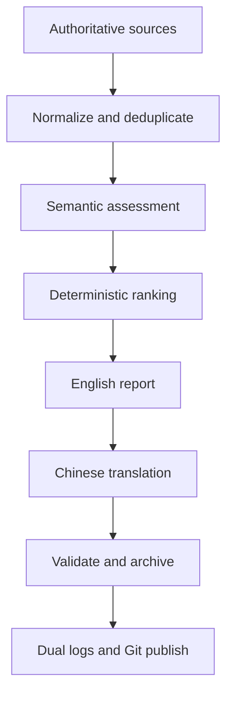

# HANews

HANews is a reproducible weekly research-intelligence pipeline for harmonic analysis. It
collects source metadata, normalizes and deduplicates research events, separates semantic
assessment from deterministic ranking, produces English and Chinese research briefings,
archives every reporting week, validates the result, records dual audit logs, and optionally
commits and pushes the generated artifacts.

The current `v0.1` collector is arXiv. The interfaces are intentionally source- and
LLM-provider-independent so authoritative journal, bibliography, seminar, and workshop
sources can be added without turning the system into an unrestricted web crawler.

## Pipeline



Collection is deliberately distinct from ranking. An LLM assesses semantic relevance,
importance, novelty, research interest, and confidence from verified metadata. Deterministic
code supplies timeliness and source reliability, aggregates documented component weights,
enforces thresholds and quotas, assembles Markdown, preserves URLs, computes weeks, writes
archives and logs, and runs Git.

## Weekly outputs

- `latest-week.md`: canonical English report.
- `latest-week-zh.md`: careful translation of the finalized English selection.
- `archive/YYYYWeekWW.md`: deterministic English ISO-week archive.
- `archive/YYYYWeekWW-zh.md`: matching Chinese archive.
- `data/items/items.jsonl`: append-only, last-write-wins event metadata history.
- `logs/generation.log`: append-only human operational history.
- `logs/runs/<timestamp>_<run-id>.json`: authoritative structured run record.

Reports begin with linked titles only: at most 20 harmonic-analysis items and 8 general
mathematics items. Detailed briefings are limited to the leading 5 and 3, respectively.
Quotas are maxima, not targets; a thin week remains thin.

## Reporting-window convention

An archive always represents one ISO week, Monday through Sunday. Without `--week`, HANews
uses the most recently completed ISO week in `America/Chicago`. The scheduled workflow runs
on Monday, so its default window is the immediately preceding seven days. Manual backfills
accept an explicit week:

```bash
hanews generate --week 2026-W36
```

The archive year and week come from the reporting period, never the execution date.

## Setup

Requirements are Python 3.11 or newer, Git, and an OpenAI API key for the configured semantic
stages.

```bash
python -m venv .venv
. .venv/bin/activate
python -m pip install -e ".[dev]"
export OPENAI_API_KEY="..."
hanews window
hanews generate --no-git
```

HANews reads secrets only from process environment variables. It does not parse `.env`
itself; `.env.example` is a reference for a shell, `direnv`, or a secret manager. Never commit
`.env` or API keys.

For GitHub Actions, add `OPENAI_API_KEY` as a repository Actions secret. The workflow has
`contents: write`, checks out `main` with credentials, tests deterministic logic, generates
the prior completed week, and preserves failure logs as a short-lived artifact.

## Configuration

All important behavior is centralized under `config/`.

| File | Responsibility |
|---|---|
| `settings.yaml` | Timezone, counts, thresholds, paths, network policy, archive and Git behavior |
| `sources.yaml` | Enabled collectors, authoritative endpoints, categories, reliability scores |
| `topics.yaml` | HA scope, adjacent areas, exclusions, and general-math editorial guidance |
| `ranking.yaml` | Auditable component weights for the two coverage domains |
| `models.yaml` | Provider and exact requested model for each LLM role |

Every ranking-weight group must sum to exactly 1. The score components remain attached to
each stored event; the final rank is never an unexplained model-provided number.

## Source and data model

Collectors implement `Collector.collect(window, retrieved_at)` and return a `CollectorResult`
with an explicit status, events, errors, and retrieval metadata. A `ResearchEvent` keeps:

- work-level `canonical_id` and event-level `event_id`;
- title, authors, source description, item type, dates, DOI and arXiv ID;
- primary, discovery, and alternate URLs plus provenance records;
- source categories and assessed topics;
- every score component, coverage decision, relationship to HA, and rationale.

Work identity prefers arXiv ID, then DOI, then a normalized title/author digest. Event identity
adds event type and event date, so a new preprint and a later journal publication can remain
separate news events. Exact identifiers and normalized-title/author overlap drive deterministic
deduplication. Ambiguous semantic deduplication is intentionally deferred rather than guessed.

`items.jsonl` is an append-only version history. A byte-equivalent rerun appends nothing; a
changed event appends a new version, and readers retain the latest version per `event_id`.

## LLM boundary

The provider adapter receives only source metadata already collected by deterministic code.
It cannot create or replace primary URLs or bibliographic identifiers. Structured Outputs
are schema-constrained and responses must return exactly the requested event IDs.

LLM tasks are limited to:

- HA/general/exclude classification and HA relationship;
- relevance, importance, novelty, interest, confidence, and topics;
- concise evidence-bounded briefings;
- translation of finalized English fields.

The Chinese report is rendered from the same ordered `ResearchEvent` objects and URLs as the
English report. The translator receives the finalized English title and briefing fields and
returns keyed translations; it cannot independently choose items or links.

## Ranking

For domain \(d\), deterministic code computes

\[
S_d(x)=\sum_j w_{d,j}s_j(x), \qquad \sum_j w_{d,j}=1.
\]

The default HA weights emphasize relevance and importance. General mathematics emphasizes
importance, novelty, and research interest. Ties are resolved by importance, interest,
confidence, normalized title, and stable event ID. Thresholds are applied before quotas.

## Archival and idempotency

The canonical archive path is a pure function of the reporting window. An identical rerun
does not rewrite it. If the same week is intentionally regenerated with different content,
the previous bytes are first retained under
`archive/revisions/YYYYWeekWW/<name>-<content-hash>.md`; identical old content creates no new
revision. Git history supplies an additional audit trail.

Important Markdown, JSON, state, and archive replacements use a temporary file, `fsync`, and
atomic `os.replace`. The human log and item history are intentionally append-only.

## Mandatory dual logging

Logging starts before collection. `generation.log` appends a clear START block immediately,
then a FINAL block with timing, model roles and exact models, source outcomes, stage counts,
report/translation/validation status, files, archives, warnings, errors, and Git state. Git
publication adds a GIT RESULT block.

The per-run JSON file is atomically updated at each stage and is the machine-readable source
of truth. Its stable, versioned contract is `schemas/run-log-v1.schema.json`. Failed runs are
finalized with the failed stage, exception type and message, and available partial statistics.
Tokens, authorization headers, and API keys are never logged.

## Git publication and the commit-hash problem

A commit cannot contain its own hash. HANews uses a bounded two-commit protocol:

1. Finalize local outputs and logs, then create and push the **report commit**.
2. Record that report commit SHA and its push outcome in both logs.
3. Create and push one **metadata finalization commit** containing only those logs.

`git.commit_hash` always means the report commit. The metadata commit deliberately does not
record its own hash. If the report push fails, the failure is logged and committed locally. If
the metadata push fails, HANews amends that one local metadata commit once with the failure
record and stops. It never enters a log/commit recursion. GitHub Actions uploads failure logs
even when a push cannot make them durable in the repository.

Only explicit generated paths are staged. A detached HEAD or a branch different from the
configured branch is a hard failure; unrelated working-tree changes are never silently added.

## Validation

Before publication, HANews verifies:

- selected dates and syntactically valid primary links;
- count and briefing limits;
- briefing membership and descending rank order;
- English index URLs against structured selections;
- Chinese/English selection and link-order parity;
- obvious secret patterns;
- run-log existence, schema version, models, window, statistics, and status.

Run tests with:

```bash
python -m unittest discover -s tests -v
# or, after installing the dev extra
pytest
ruff check .
```

## Failure policy

Source failures are recorded individually. A partial source outage is a warning; failure of
every enabled source fails the run. Malformed metadata, invalid model output, missing IDs,
translation drift, archive problems, corrupt JSONL, validation failure, Git failure, and push
failure are explicit errors. The pipeline never fills quotas with weak items and never
silently publishes a partially validated report.

See [ARCHITECTURE.md](ARCHITECTURE.md) for module boundaries, invariants, and extension points.

## Highest-value next improvements

1. Add Crossref and OpenAlex enrichment, including audited DOI–arXiv correspondence.
2. Add official seminar, workshop, journal, and author-page collectors with source-specific
   change detection for talks, acceptances, and major revisions.
3. Introduce a human review queue and small labeled evaluation set for relevance, importance,
   briefing faithfulness, and Chinese terminology.
4. Add conservative fuzzy/LLM-assisted deduplication only for unresolved candidate pairs, with
   every merge decision retained as provenance.
5. Add citation/recommendation signals as low-weight, time-aware features after testing for
   fame, venue, language, and subfield bias.

